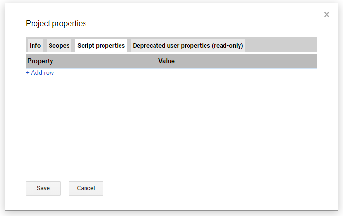
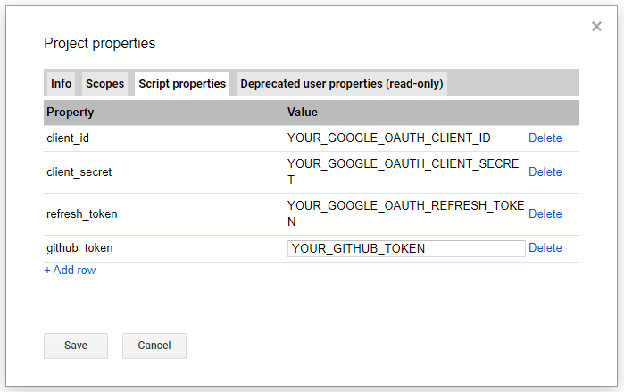
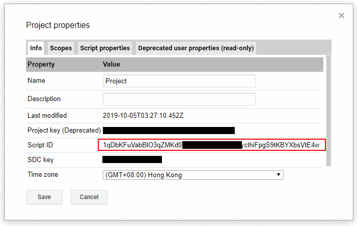
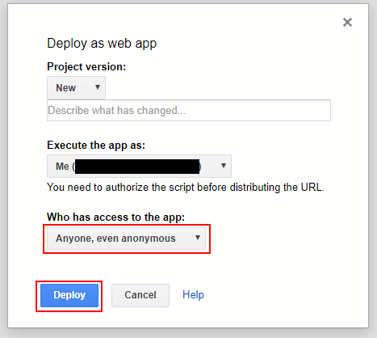
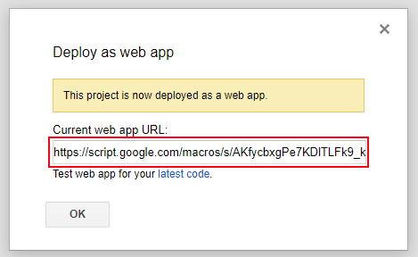
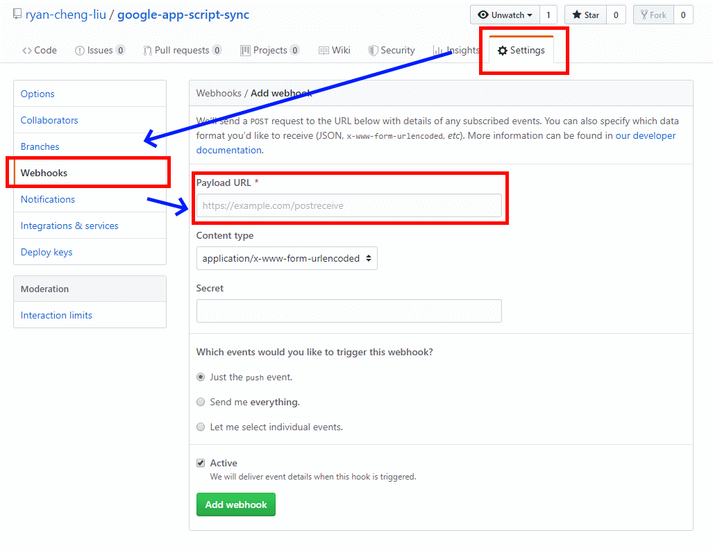

# google-app-script-sync
Sync your github project to google app script

## Installation
1. Copy the script to an INDEPENDENT google app script project.
2. Open [Project properties] -> [Script properties]
  
    

3. Create properties named [client_id],[client_secret],[refresh_token].
    If you want to access private repo, you should create [github_token].
      
        
        
4. Create properties named [master_project], fill it as your project id.
          
        

5. Deploy this project and you'll get a link to this project
          
        
          
        

6. Paste the link to github project webhook
          
                

7. Go to the Google App Script Project you want to sync with github.
        Get the deploy link like "https://script.google.com/marcos/s/{YOUR_DEPLOYMENT_ID}}/exec"
        and get YOUR_DEPLOYMENT_ID.

8. Back to your github-sync project, Create properties named [master_deployment_id], and paste your deployment id.
    For test project, create [test_deployment_id].

9. You're done! when somebody push at the github repo,
    Your google app script will sync and deploy.